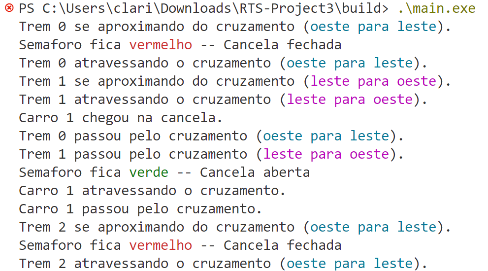

# STR Projeto 3: Simulação de cruzamento de trilhos de trem
## Objetivo
O projeto envolve criar um sistema que simule o funcionamento de um cruzamento entre uma linha ferroviária e uma via de carros. Neste cenário, os trens e os carros podem se aproximar de qualquer das direções. Para evitar colisões, sempre que um trem se aproxima do cruzamento, uma cancela deve ser fechada e os veículos devem parar. A sincronização do acesso ao cruzamento é crucial e será gerenciada usando semáforos. Você deverá aplicar os conceitos de sincronização e exclusão mútua.
## Descrição detalhada do projeto
Desenvolver um programa que simule o comportamento de um cruzamento entre uma linha ferroviária e uma via de veículos automotivos controlado por um semáforo (cancela) para garantir a passagem segura dos trens e veículos.
Existe uma via de veículos que é cruzada por uma linha ferroviária. Quando um trem se aproxima do cruzamento, o semáforo fica vermelho e a cancela é fechada para garantir a segurança. Quando o trem cruza, a cancela aberta e o semáforo fica verde.
### Requisitos
**-Modelagem dos trens e carros:** cada trem e cada carro deve ser representado por uma thread (ou processo). Eles podem vir de qualquer uma das quatro direções. O importante é que em nenhum momento exista mais de um trem no cruzamento e no mesmo sentido no mesmo instante.

**-Cruzamento:** Deve ser tratado como um recurso compartilhado, onde o acesso é controlado por semáforos. Note que podemos ter dois trens cruzando se eles estiverem em sentidos opostos. Os carros só podem cruzar se a cancela não estiver abaixada e a passagem do trem sempre tem prioridade.

**-Semáforos:** utilizar semáforos para gerenciar o acesso ao cruzamento. Deve-se garantir que os semáforos sejam usados para evitar condições de corrida e deadlocks, permitindo uma passagem segura e eficiente.

**-Interface com o usuário:** uma interface simples que mostre o estado atual dos trens e dos carros (aproximando-se, passando, e passou) e a situação do cruzamento. Pode ser um simples output de texto ou uma interface gráfica básica.
## Pré-requisitos
- Sistema Operacional: Windows.
- Controle de Versão: Git.
- Ambiente de desenvolvimento: Visual Studio Code
## Instruções de uso
Para funcionamento do projeto o usuário deve seguir os passos descritos abaixo.
1. Fazer o download do FreeRTOS v10.0.1
2. Criar uma variável de ambiente denominada **FREERTOS_PATH** que deve conter o caminho para a pasta do FreeRTOS v10.0.1
3. Clonar esse projeto
```bash
git clone https://github.com/claricesoares/RTS-Project3.git
```
4. Abrir o projeto no VSCode e fazer a build do projeto seguindo o menu **Terminal** -> **Run Build Task** ou pressionando as teclas de atalho **Ctrl + Shift + B**
5. Navegar até a pasta de build
```bash
cd build
```
6. Compilar o arquivo executável
```bash
.\main.exe
```
**Obeservação:** Ao realizar a build pela primeira vez, o VSCode pode apresentar um erro. Repita o comando para corrigir o problema, que geralmente é resolvido na segunda tentativa.

## Saída esperada




## Demonstração e explicação

## Equipe

- [Clarice Soares](https://github.com/claricesoares)

- [Julia Ramalho](https://github.com/ramalhocsjulia)

- [Samara Cardoso](https://github.com/SamaraLimaCardoso)